### Installing *CentOS 7* on VirtualBox
1. Download ISO image from [this link](http://mirrors.standaloneinstaller.com/centos/7.9.2009/isos/x86_64/CentOS-7-x86_64-NetInstall-2009.iso)

2. Open **VirtualBox** and go to **Machine** menu and then click on **New**. You can press **CTRL+N**. Create virtual machine window appears.
   - **Name**: lpic-centos
   - **Machine Folder**: Change this if this location has not enough space otherwise leave it as it's default value
   - **Type**: Linux
   - **Version**: Red Hat (64-bit)

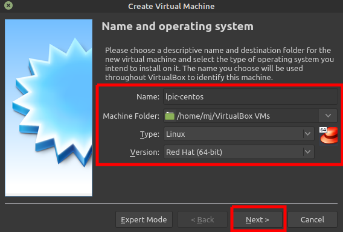

3. Click **next**. In this window you should config the virtual machine memory. 1024MB (1GB) memory is enough for our lab. But you can change it according to your need.

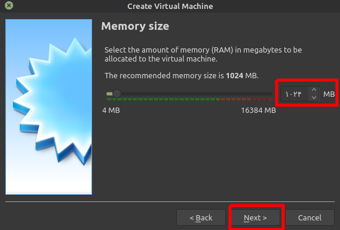

4. Click **next** and you will see Hard disk confoguration window. Click on **create** button and leave everything default.

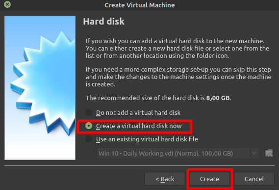

5. Leave everything default in "Hard disk file type" window and click **next**.

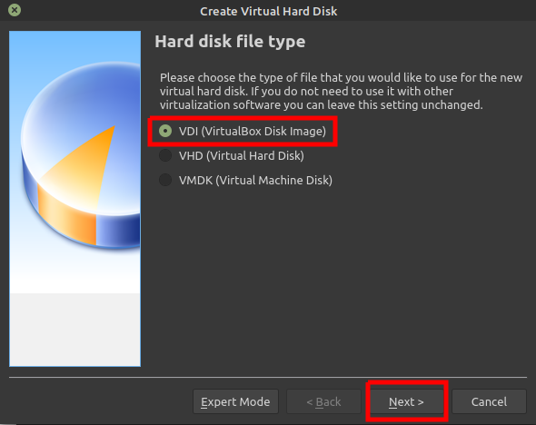

6. In this window, select **Dynamically allocated** and click **next**.

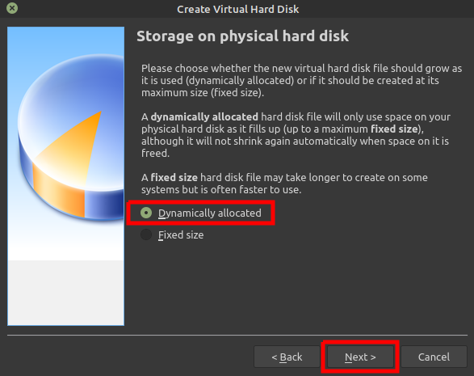

7. You can change the hard disk size. The default value is enough. But you can increase it as you want but don't decrease it. Then click **create** button.

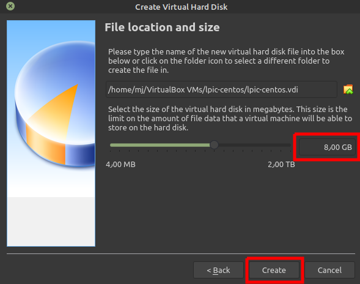

8. Now you will see the newly created virtual machine (**lpic-centos**).

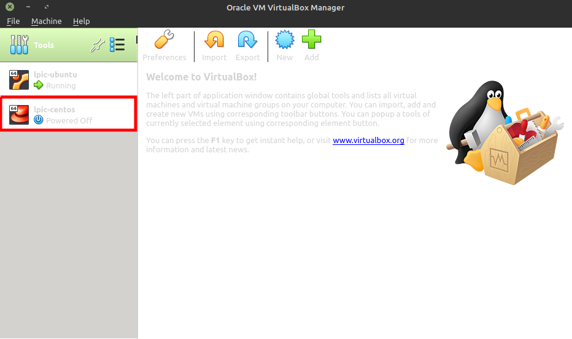

9. **Right click** on **lpic-centos** machine and click **settings**. Then go to **Network** Section and select **Adapter 2** tab. Do the following changes:
    - Check the **Enable Network Adapter** check box.
    - Select **Host-only adapter** for **Attached To** drop-down.
    - Select **vboxnet0** for **Name** drop-down.

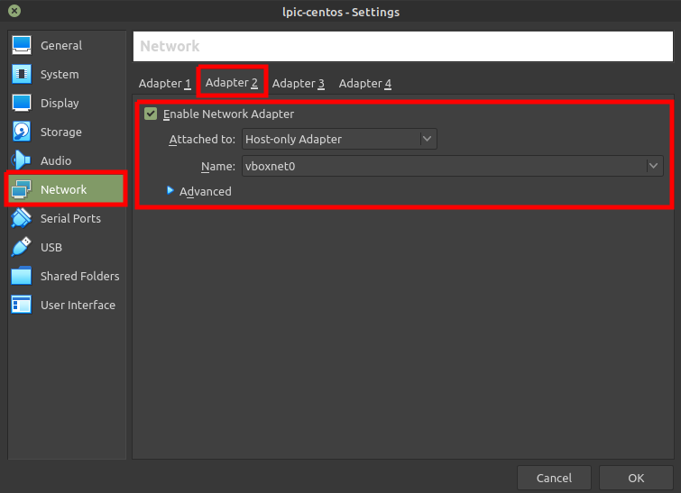

10. Now goto **Storage** section and below **Controller: IDE** select **Empty**. Then click on  (**Disk icon**) and from the pop-up menu, select **Choose a disk file**.

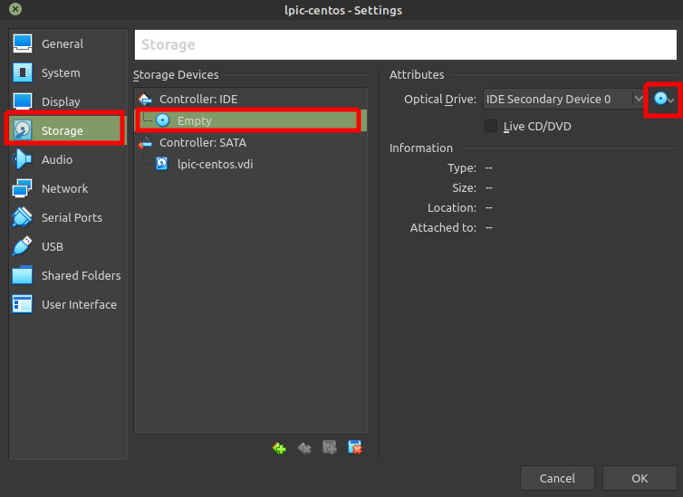

11. Now do the following
    - Select your **centos ISO image** and click **open**.
    - Then click **OK** to close the virtual mahchine settings window.

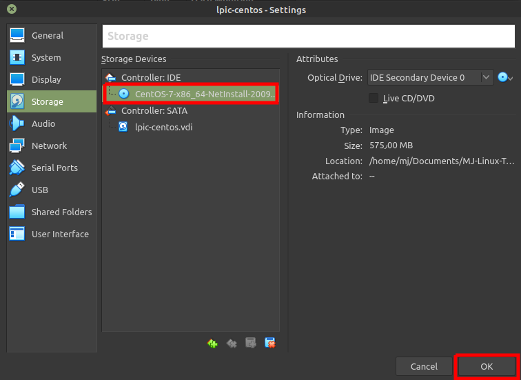

12. Select **lpic-centos** machine and click on **Start** button.

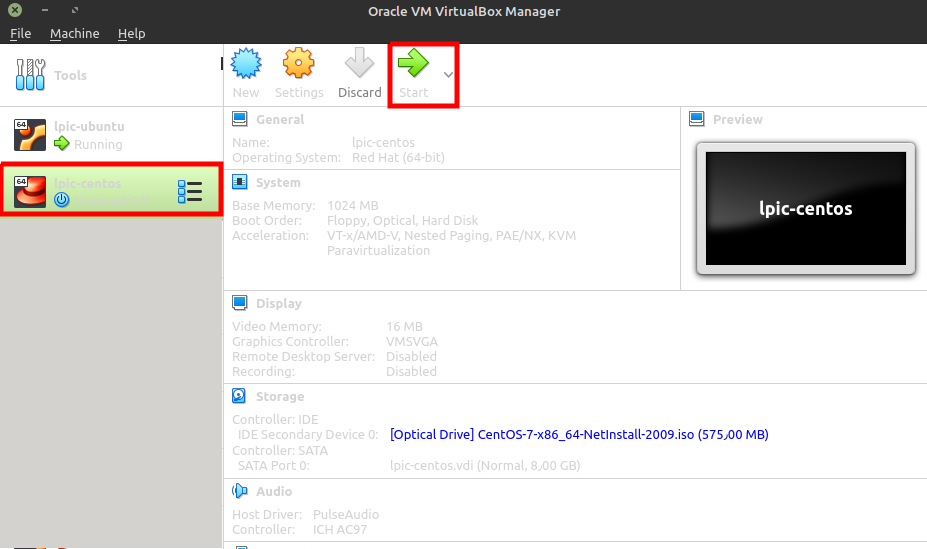

13.  The virtual machine starts and boots from the provided ISO image. Using **UP arrow key**, select **Install CentOS 7** and press **Enter**.

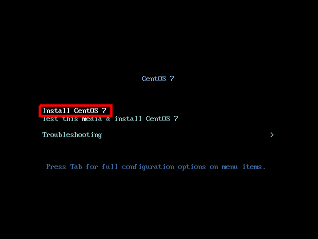

14. Choose your language and click on **Continue** button.

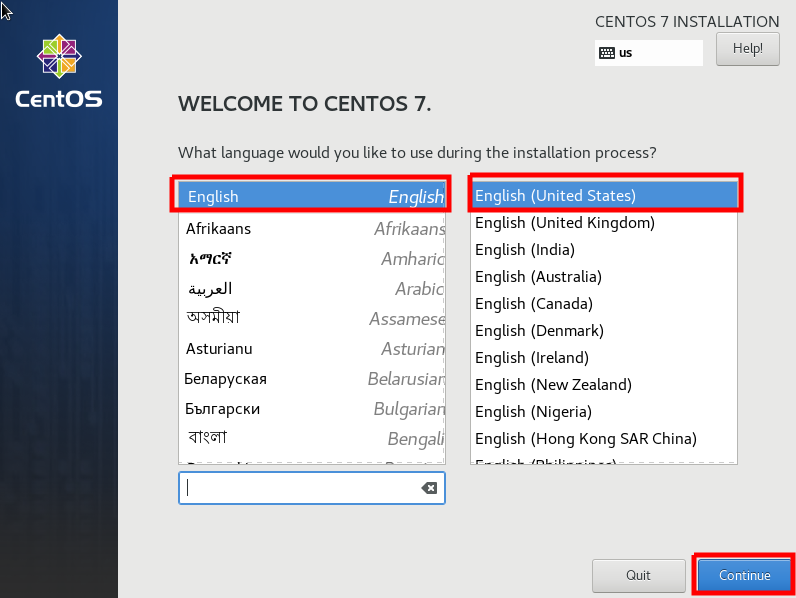

15. ssdsd

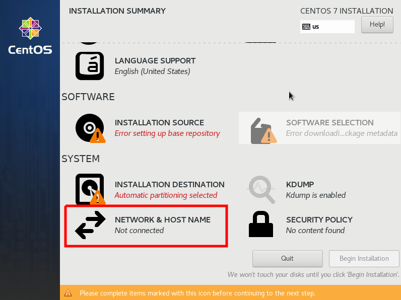

