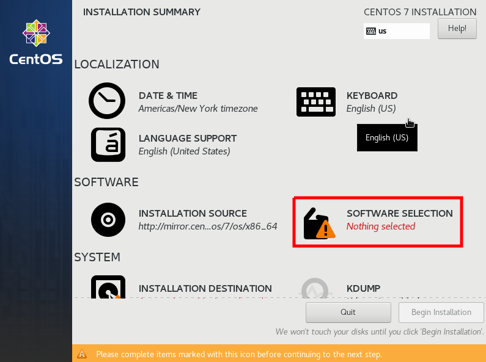
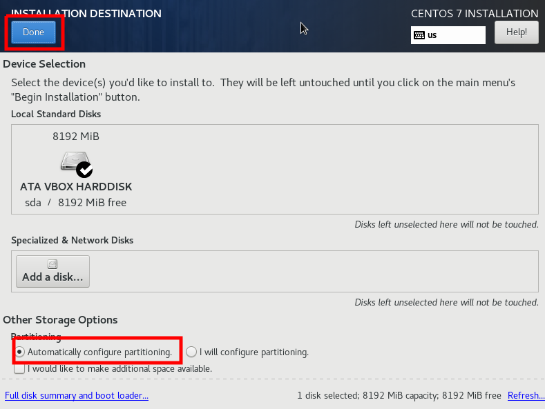

### Installing *CentOS 7* on VirtualBox
1. Download ISO image from [this link](http://mirrors.standaloneinstaller.com/centos/7.9.2009/isos/x86_64/CentOS-7-x86_64-NetInstall-2009.iso)

2. Open **VirtualBox** and go to **Machine** menu and then click on **New**. You can press **CTRL+N**. Create virtual machine window appears.
   - **Name**: lpic-centos
   - **Machine Folder**: Change this if this location has not enough space otherwise leave it as it's default value
   - **Type**: Linux
   - **Version**: Red Hat (64-bit)

3. Click **next**. In this window you should config the virtual machine memory. 1024MB (1GB) memory is enough for our lab. But you can change it according to your need.

4. Click **next** and you will see Hard disk confoguration window. Click on **create** button and leave everything default.

5. Leave everything default in "Hard disk file type" window and click **next**.

6. In this window, select **Dynamically allocated** and click **next**.

7. You can change the hard disk size. The default value is enough. But you can increase it as you want but don't decrease it. Then click **create** button.

8. Now you will see the newly created virtual machine (**lpic-centos**).

9. **Right click** on **lpic-centos** machine and click **settings**. Then go to **Network** Section and select **Adapter 2** tab. Do the following changes:
    - Check the **Enable Network Adapter** check box.
    - Select **Host-only adapter** for **Attached To** drop-down.
    - Select **vboxnet0** for **Name** drop-down.

10. Now goto **Storage** section and below **Controller: IDE** select **Empty**. Then click on  (**Disk icon**) and from the pop-up menu, select **Choose a disk file**.

11. Now do the following
    - Select your **centos ISO image** and click **open**.
    - Then click **OK** to close the virtual mahchine settings window.

12. Select **lpic-centos** machine and click on **Start** button.

13.  The virtual machine starts and boots from the provided ISO image. Using **UP arrow key**, select **Install CentOS 7** and press **Enter**.

14. Choose your language and click on **Continue** button.

15. Scroll-down a bit and click on **NETWORK & HOST NAME**.

16. Click on **Ethernet (enp0s3)** and then on the right side change **OFF** to **ON** to enable it

16. Click on **Ethernet (enp0s8)** and then on the right side change **OFF** to **ON** to enable it. Also click on **Configure...** button to configure a static IPv4 for this ethernet.
    - **\*\*\* Note**: Before go further, write down the current IP address that our network adapter got from DHCP server (In my case this IP address is `192.168.56.104/24` ).

17. Select **IPv4 Settings** tab. Change the **Method** to **Manual** and click on **Add** button. Now you can fill the **Address** and **Netmask** field. Then click on **Save** button.

18. Change the `localhost.localdomain` to **lpic-centos.localdomain** and press the **Apply** button. Then click on **Done** to save the configuration.

19. Click on **INSTALLATION SOURCE** to define it.

20. Type **mirror.centos.org/centos/7/os/x86_64** in the box and then click on **Done** button.

21. Click on **SOFTWARE SELECTION** to choose type of installation.

22. On the left side, select **Minimal Install** and the right side select **Compatibility Libraries** and **System Administration Tools**. Then click on **Done** to save the configuration.

23. Click on **INSTALLATION DESTINATION** to configure hard disk partitioning.

24. We use automatic method, so check the **Automatically configure partitioning** and click on **Done** button.

25. Now we can start the installation by clicking on **Begin Installation**

26. To set the **root** account's password, click on **ROOT PASSWORD**.

27. Define the password and press **Done** button. **Don't forget** this password. You might need it in the future.

28. We don't want to use root account for our works. We must create a user with administrative access. To do so, click on **USER CREATION** button.

29.  In this step, you should provide your server and user information and also the credentials. for **Name**, **Username** you could use the below information and fill the password as you wish. **\*\*\* Please don't forget username and the password. We need them to login to our server!**. Also make sure the **Make this user administrator** is checked. Then click on **Done** button to save the configuration.

30. When installation ends, the **Reboot** button will appear. Click on **Reboot** buton and wait for machine to reboot.

31. To login to your server, you should use the credentials you have set in **Step 25**. Next to **login:**, type your username (my username is **student**), then press **Enter**. **\*\*\*Note**: Password will not show while you are typing. Don't worry! Type your password and press **Enter**.

32. We want to update our repository and upgrade the applications which need it. So, run this command `sudo yum update` to do it. You might be asked to enter your password when you use **sudo**. So enter it and press **Enter**.

33. If downlaod needed, It will ask you to confirm it by typing **y** and pressing **Enter** key.

34.  To confirm newly downloaded firmware key, type **y** and press **Enter** key.

35. When you see **Complete!**, it means our upgrade is completed and no more action is required.

36. To be sure that our network adapters are configured properly, run `nmcli` command. Sometime after CentOS installtion, 2nd adapter is disabled as you can see in the below image

37. To fix that run the command `sudo nmtui`.

38. Highlight **Activate a connection** and press **Enter**.

39. Highlight **enp0s8** and then using **Right arrow key**, highlight the **\<Activate\>** and hit **Enter**.

40. Choose **\<Back\>**

41. To quit this app, select **Quit** and press **Enter**.

42. Run **`nmcli`** again to confirm that all network adapters are active and has the IP address we configured during the installation. You could use this **IP address** to login to the server using **SSH**.

43.  Run **`sudo yum install nano git -y`** to insall both **nano** editor and **git** application.

44.  Check [Login to server using SSH](SSH-README.md#login-to-server-using-ssh) guide. We will login to our server using **SSH**. In real-wolrd scenarios, no one logins to server directly from the console and we do it too. So check [this guide](SSH-README.md#login-to-server-using-ssh) and do the same for your future logins.

