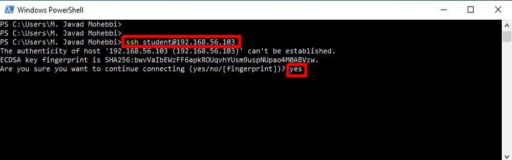
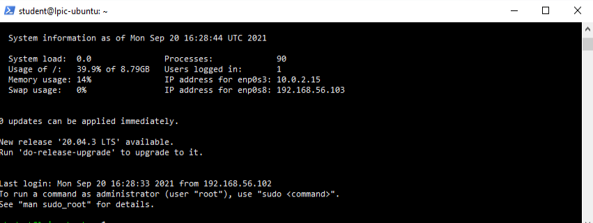
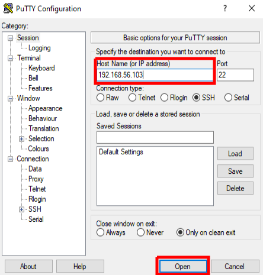
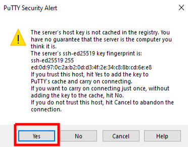
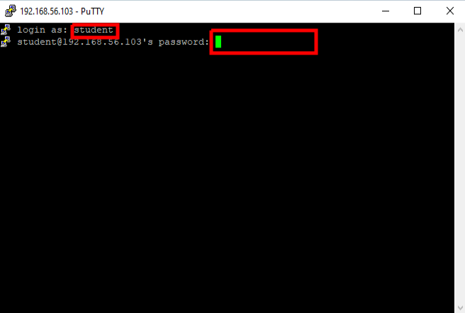
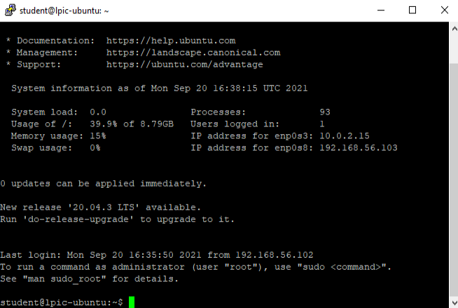
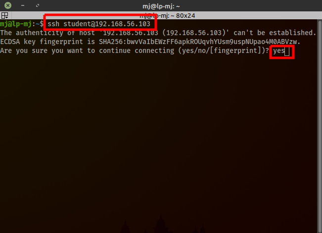
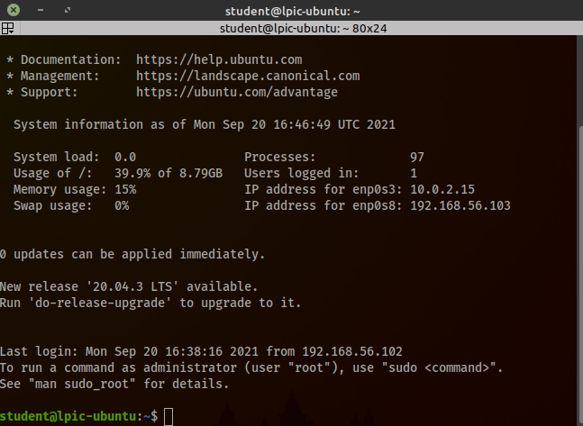

### Login to server using SSH
##### Windows OS:
  1. Using PowerShell on Windows 10 or above.
     - Open **PowerShell** and use this schema **ssh username@server-address** to login to your server using **SSH**. In my case `ssh student@192.168.56.103`.
     - **\*\*\*Note**: First time, you might be asked to trust the host. Type **yes** and press **Enter** to login
     
     - Then provide your password and press **Enter**.
     - If the provided infromation are correct, you will see the below page:
     

  2. Using Putty software.
     - Download Putty from [this link](https://the.earth.li/~sgtatham/putty/latest/w64/putty-64bit-0.76-installer.msi).
     - Install it using the installation wizard.
     - Open **Putty** software.
     - Provide the IP address. In my case `192.168.56.103`
     
     - **\*\*\*Note**: First time, you might be asked to trust the host. Press the **Yes** button to trust it.
     
     - Provide your username and password. My username is `student`
     
     - If the provided infromation are correct, you will see the below page:
     

##### Linux & macOS:
- Open **Terminal** and use this schema **ssh username@server-address** to login to your server using **SSH**. In my case `ssh student@192.168.56.103`.
- **\*\*\*Note**: First time, you might be asked to trust the host. Type **yes** and press **Enter** to login

- Then provide your password and press **Enter**.
- If the provided infromation are correct, you will see the below page:

